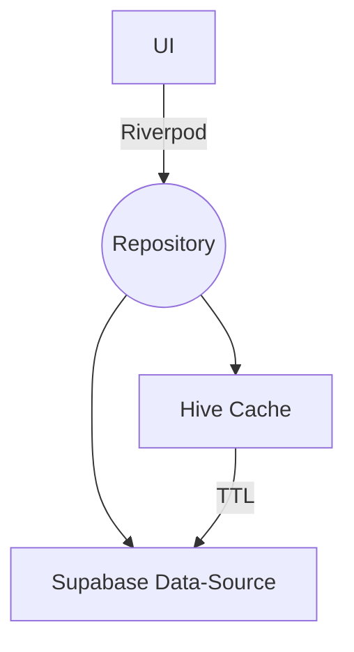

# JO17 Tactical Manager – SaaS Platform (Flutter 3.32 / Supabase)


All-in-one coaching platform for youth football teams. 100 % Flutter, running **offline-first** with Supabase cloud sync.

---

## ✨ Features
* Player, Match & Training management
* Exercise designer, Field diagram editor
* Annual planning & periodisation
* Multi-tenant SaaS with RBAC (5 roles)
* Offline Hive cache with automatic sync
* CI/CD on Netlify, Coverage gate ≥ 40 %

Live demo 👉 https://teamappai.netlify.app (login: demo@voab.nl / demo123)

---

## 🏗️ Architecture (2025)

* Each domain (Players, Matches, …) gets its own repository (`*_repository.dart`).
* All repository methods return `Result<T>`.
* Providers depend **only** on repository abstractions → easy testing.

See the detailed guide: `docs/guides/REPOSITORY_USAGE_GUIDE_2025.md`.

---

## ⚙️ Local Setup
```bash
# 1. Install Flutter 3.32 + dart 3.8
# 2. Clone repo and enter module directory
cd jo17_tactical_manager

# 3. Get packages & generate code
flutter pub get
flutter pub run build_runner build --delete-conflicting-outputs

# 4. Run tests (should be green)
flutter test

# 5. Launch
flutter run -d chrome --web-port 8081
```

### Environment
Create a `.env` file (see `lib/config/environment.dart`) or export via CLI:
```
export SUPABASE_URL=https://<project>.supabase.co
export SUPABASE_KEY=public-anon-key
```

---

## 📚 Documentation Map
| Doc | Purpose |
|-----|---------|
| `docs/architecture/ARCHITECTURE.md` | Full system design |
| `docs/plans/architecture/REPOSITORY_LAYER_REFRACTOR_Q3_2025.md` | Migration plan & milestones |
| `docs/guides/REPOSITORY_USAGE_GUIDE_2025.md` | Cookbook & best practices |
| `docs/roadmaps/ROADMAP_OVERVIEW.md` | Feature roadmap & progress |

---

## 🤝 Contributing
1. Fork & create a branch.
2. Run `dart format . && flutter analyze` (0 errors).
3. Add/Update tests; coverage must not drop.
4. Submit PR.

---

© 2025 TEAMAPP.AI – Released under MIT License
