# Security Remediation Implementation Plan 2025
**JO17 Tactical Manager - Database Security Fixes**
**Datum:** 1 augustus 2025
**Methode:** Simpel maar effectief volgens moderne best practices

---

## 🎯 **PRIORITEITSVOLGORDE**

```mermaid
graph TD
    A[🚨 KRITIEK: API Keys] --> B[🔶 Runtime Errors]
    B --> C[🔶 Security Headers]
    C --> D[🔍 Monitoring & Testing]
```



---

## 🚨 **FASE 1: KRITIEKE API KEY FIX (2 uur)**

### **1.1 GitHub Secrets Setup (15 min)**
```bash
# Via GitHub Repository Settings → Secrets and variables → Actions
SUPABASE_URL_DEV=https://ohdbsujaetmrztseqana.supabase.co
SUPABASE_ANON_KEY_DEV=eyJ... # Nieuwe key voor dev
SUPABASE_URL_PROD=https://ohdbsujaetmrztseqana.supabase.co
SUPABASE_ANON_KEY_PROD=eyJ... # Nieuwe key voor prod
SUPABASE_URL_TEST=https://ohdbsujaetmrztseqana.supabase.co
SUPABASE_ANON_KEY_TEST=eyJ... # Nieuwe key voor test
```

### **1.2 Environment Configuration Fix (30 min)**
**Bestand:** `lib/config/environment.dart`

```dart
// NEW: Secure environment configuration 2025
enum Environment {
  development._(
    name: 'Development',
    supabaseUrl: _getEnvVar('SUPABASE_URL_DEV'),
    supabaseAnonKey: _getEnvVar('SUPABASE_ANON_KEY_DEV'),
    // Verwijder hardcoded keys!
  ),

  production._(
    name: 'Production',
    supabaseUrl: _getEnvVar('SUPABASE_URL_PROD'),
    supabaseAnonKey: _getEnvVar('SUPABASE_ANON_KEY_PROD'),
  );

  // Secure environment variable getter
  static String _getEnvVar(String key) {
    return const String.fromEnvironment(key,
      defaultValue: 'MISSING_ENV_VAR_$key');
  }
}
```

### **1.3 Build Configuration Update (30 min)**
**Bestand:** `web/index.html` - voeg toe:

```html
<script>
  // Inject environment variables at build time
  window.environmentConfig = {
    supabaseUrl: '{{SUPABASE_URL}}',
    supabaseAnonKey: '{{SUPABASE_ANON_KEY}}'
  };
</script>
```

### **1.4 GitHub Actions Update (45 min)**
**Bestand:** `.github/workflows/deploy.yml`

```yaml
name: Deploy with Security 2025
on:
  push:
    branches: [main]

jobs:
  deploy:
    runs-on: ubuntu-latest
    steps:
      - uses: actions/checkout@v4

      - name: Setup Flutter
        uses: subosito/flutter-action@v2
        with:
          flutter-version: '3.24.0'

      - name: Build with environment secrets
        run: |
          flutter build web \
            --dart-define=SUPABASE_URL_PROD=${{ secrets.SUPABASE_URL_PROD }} \
            --dart-define=SUPABASE_ANON_KEY_PROD=${{ secrets.SUPABASE_ANON_KEY_PROD }} \
            --release

      - name: Deploy to production
        # Your deployment step here
```

---

## 🔶 **FASE 2: RUNTIME ERRORS FIX (1 uur)**

### **2.1 Null Safety Improvements (30 min)**
**Globale error handler toevoegen:**

```dart
// lib/core/error_handler.dart
class GlobalErrorHandler {
  static void initialize() {
    FlutterError.onError = (FlutterErrorDetails details) {
      // Log error but don't crash
      AppLogger.e('Flutter Error: ${details.exception}',
                   stackTrace: details.stack);

      // In production, show user-friendly message
      if (Environment.isProduction) {
        // Show snackbar instead of crash
        _showErrorSnackbar('Er is een fout opgetreden');
      }
    };
  }

  static void _showErrorSnackbar(String message) {
    // Implementation for user notification
  }
}
```

### **2.2 Defensive Programming Pattern (30 min)**
**In alle repository classes:**

```dart
// Voorbeeld: lib/repositories/supabase_player_repository.dart
class SupabasePlayerRepository {
  @override
  Future<Result<List<Player>>> getPlayers() async {
    try {
      final response = await _client
          .from('players')
          .select()
          .eq('organization_id', _currentOrgId ?? '');

      // Null safety check
      if (response == null) {
        return Result.error('No data received');
      }

      final players = (response as List<dynamic>?)
          ?.map((json) => Player.fromJson(json))
          .whereType<Player>() // Filter out nulls
          .toList() ?? [];

      return Result.success(players);
    } catch (e, stackTrace) {
      AppLogger.e('Error fetching players: $e', stackTrace: stackTrace);
      return Result.error('Failed to load players: ${e.toString()}');
    }
  }
}
```

---

## 🔶 **FASE 3: SECURITY HEADERS (30 min)**

### **3.1 Web Security Headers**
**Bestand:** `web/index.html` - update `<head>`:

```html
<head>
  <!-- Security Headers 2025 -->
  <meta http-equiv="Content-Security-Policy"
        content="default-src 'self';
                 script-src 'self' 'unsafe-inline' *.supabase.co;
                 style-src 'self' 'unsafe-inline';
                 img-src 'self' data: *.supabase.co;
                 connect-src 'self' *.supabase.co;">

  <meta http-equiv="X-Frame-Options" content="DENY">
  <meta http-equiv="X-Content-Type-Options" content="nosniff">
  <meta http-equiv="Referrer-Policy" content="strict-origin-when-cross-origin">

  <!-- Existing content -->
  <title>JO17 Tactical Manager</title>
</head>
```

### **3.2 Netlify Headers (if using Netlify)**
**Bestand:** `web/_headers`

```
/*
  X-Frame-Options: DENY
  X-Content-Type-Options: nosniff
  Referrer-Policy: strict-origin-when-cross-origin
  Permissions-Policy: camera=(), microphone=(), geolocation=()
```

---

## 🔍 **FASE 4: MONITORING & VERIFICATION (1 uur)**

### **4.1 Security Monitoring Script**
**Bestand:** `scripts/security_check.sh`

```bash
#!/bin/bash
set -e

echo "🔍 Security Check 2025"
echo "======================"

# Check for hardcoded secrets
echo "Checking for hardcoded secrets..."
if grep -r "eyJ" lib/ --exclude-dir=.git; then
    echo "❌ KRITIEK: Hardcoded JWT tokens gevonden!"
    exit 1
else
    echo "✅ Geen hardcoded secrets gevonden"
fi

# Check environment configuration
echo "Checking environment setup..."
if flutter build web --dart-define=TEST_BUILD=true > /dev/null 2>&1; then
    echo "✅ Build succesvol met environment variables"
else
    echo "❌ Build gefaald - check environment setup"
    exit 1
fi

# Check dependencies voor vulnerabilities
echo "Checking dependencies..."
flutter pub deps --json | jq '.packages[] | select(.source == "hosted")' | head -5

echo "✅ Security check compleet!"
```

### **4.2 Pre-commit Hook Setup**
**Bestand:** `.githooks/pre-commit`

```bash
#!/bin/bash
# Run security check before each commit

echo "Running security checks..."
./scripts/security_check.sh

if [ $? -eq 0 ]; then
    echo "✅ Security checks passed"
else
    echo "❌ Security checks failed - commit blocked"
    exit 1
fi
```

### **4.3 Automated Security Testing**
**Bestand:** `.github/workflows/security-test.yml`

```yaml
name: Security Tests
on: [push, pull_request]

jobs:
  security:
    runs-on: ubuntu-latest
    steps:
      - uses: actions/checkout@v4

      - name: Run security checks
        run: |
          chmod +x scripts/security_check.sh
          ./scripts/security_check.sh

      - name: Dependency vulnerability scan
        run: |
          flutter pub deps --json > deps.json
          # Add vulnerability checking logic
```

---

## 📋 **IMPLEMENTATIE CHECKLIST**

### **Week 1: Kritieke Fixes**
- [ ] **Dag 1:** GitHub secrets configureren
- [ ] **Dag 1:** Environment.dart refactoren (GEEN hardcoded keys meer)
- [ ] **Dag 2:** Build process updaten met secrets
- [ ] **Dag 2:** Nieuwe Supabase keys genereren en rotatie
- [ ] **Dag 3:** Deploy testen met nieuwe setup

### **Week 2: Stabiliteit & Monitoring**
- [ ] **Dag 1:** Null safety fixes implementeren
- [ ] **Dag 1:** Global error handler toevoegen
- [ ] **Dag 2:** Security headers configureren
- [ ] **Dag 3:** Monitoring scripts opzetten
- [ ] **Dag 3:** Pre-commit hooks installeren

### **Week 3: Verificatie & Optimalisatie**
- [ ] **Dag 1:** Volledige security test uitvoeren
- [ ] **Dag 2:** Performance impact meten
- [ ] **Dag 3:** Documentatie updaten
- [ ] **Dag 3:** Team training over nieuwe security setup

---

## 🛠️ **MODERNE 2025 TOOLS STACK**

```yaml
Security Tools:
  - GitHub Advanced Security (gratis voor public repos)
  - Dependabot (automatische dependency updates)
  - CodeQL (static analysis)
  - Flutter secure coding practices

Monitoring:
  - Sentry (error tracking) - gratis tier
  - Google Analytics 4 (user monitoring)
  - Supabase Dashboard (database monitoring)

CI/CD:
  - GitHub Actions (built-in security scanning)
  - Automated testing pipeline
  - Secrets management via GitHub Secrets
```

---

## 💡 **BEST PRACTICES 2025 HIGHLIGHTS**

### **🔐 Secrets Management**
- ✅ GitHub Secrets voor CI/CD
- ✅ Runtime environment variables
- ✅ Verschillende keys per environment
- ❌ Geen hardcoded credentials meer

### **🛡️ Defense in Depth**
- ✅ Multiple security layers
- ✅ Input validation + output encoding
- ✅ Error handling zonder information disclosure
- ✅ Progressive security hardening

### **📊 Continuous Security**
- ✅ Automated vulnerability scanning
- ✅ Pre-commit security checks
- ✅ Regular dependency updates
- ✅ Security metrics dashboard

---

## 🚀 **QUICK START COMMANDS**

```bash
# 1. Clone en setup
git clone [repository]
cd jo17_tactical_manager

# 2. Install security tools
chmod +x scripts/security_check.sh
git config core.hooksPath .githooks

# 3. Test current security status
./scripts/security_check.sh

# 4. Setup GitHub secrets (via web interface)
# Add: SUPABASE_URL_PROD, SUPABASE_ANON_KEY_PROD, etc.

# 5. Deploy with new security setup
git add . && git commit -m "security: implement 2025 best practices"
git push origin main
```

---

## 📞 **SUPPORT & ESCALATION**

**Bij problemen tijdens implementatie:**
1. **Check GitHub Actions logs** voor build errors
2. **Verify secrets configuration** in repository settings
3. **Test lokaal eerst** met `--dart-define` parameters
4. **Rollback plan:** Revert to previous commit if needed

**Success Metrics:**
- ✅ Geen hardcoded secrets in codebase
- ✅ Alle builds slagen met environment variables
- ✅ Geen runtime JavaScript errors
- ✅ Security headers present in production
- ✅ Automated security checks in CI/CD

---

*Plan follows industry-standard security practices en zorgt voor minimale downtime tijdens implementatie.*
