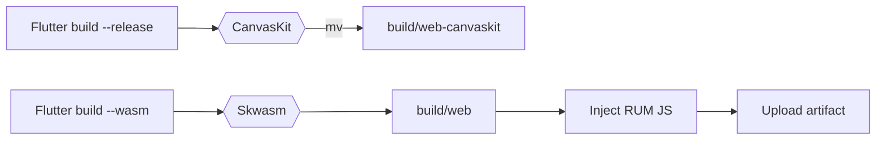
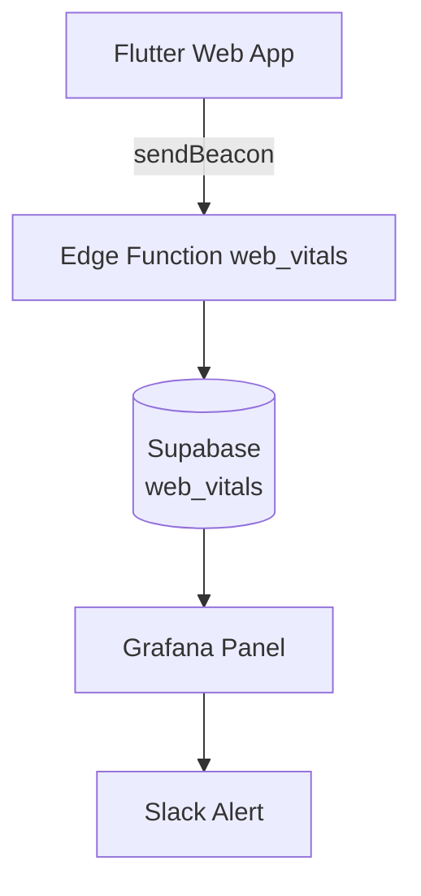

# JO17 Tactical Manager - Architecture Document

## 📋 Inhoudsopgave

1. [Project Overzicht](#project-overzicht)
2. [Technische Stack](#technische-stack)
3. [Architectuur Overzicht](#architectuur-overzicht)
4. [Project Structuur](#project-structuur)
5. [Data Models](#data-models)
6. [State Management](#state-management)
7. [UI/UX Design](#uiux-design)
8. [Platform Support](#platform-support)
9. [Huidige Status](#huidige-status)
10. [Bekende Issues](#bekende-issues)
11. [Toekomstige Ontwikkeling](#toekomstige-ontwikkeling)
12. [Development Guidelines](#development-guidelines)

## 🎯 Project Overzicht

JO17 Tactical Manager is een hybride Flutter applicatie voor het beheren van jeugdvoetbalteams (JO17). De app biedt functionaliteit voor:

- **Spelersbeheer**: Registratie, tracking en performance monitoring
- **Trainingsbeheer**: Planning, aanwezigheid en voortgang
- **Wedstrijdbeheer**: Planning, opstellingen en resultaten
- **Statistieken**: Team en individuele prestatie-indicatoren
- **Performance Rating**: 5-sterren beoordelingssysteem
- **Import/Export**: Excel/CSV import en export functionaliteit

### Doelgroep
- Voetbaltrainers en coaches van JO17 teams
- Team managers en assistenten
- Technische staf

### Core Features
- Offline-first architectuur
- Cross-platform (iOS, Android, Web, macOS)
- Nederlandse interface
- Real-time synchronisatie (toekomstig)
- Import/Export functionaliteit

## 🛠 Technische Stack

### Frontend Framework
- **Flutter 3.32.2**: Cross-platform UI framework
- **Dart**: Programmeertaal

### State Management
- **Riverpod 2.5.1**: Reactive state management
- **flutter_riverpod**: Flutter integratie

### Database
- **Isar 3.1.0**: NoSQL database voor mobile/desktop
- **Mock implementation**: Tijdelijke oplossing voor web
- **Supabase** (dependencies aanwezig): Toekomstige cloud database

### Navigation
- **go_router 14.2.0**: Declarative routing

### UI/Design
- **Material 3**: Design system
- **google_fonts 6.2.1**: Typography (Inter font)
- **fl_chart 0.68.0**: Grafieken en visualisaties
- **table_calendar 3.1.3**: Kalender functionaliteit

### Import/Export
- **excel 4.0.2**: Excel bestanden lezen/schrijven
- **csv 6.0.0**: CSV bestanden verwerken
- **file_picker 10.1.9**: Bestandsselectie
- **file_saver 0.2.14**: Bestanden downloaden
- **pdf 3.10.8**: PDF generatie

### Development Tools
- **build_runner**: Code generation
- **flutter_lints**: Code quality
- **riverpod_generator**: Provider generation (voorbereid)

### Toekomstige Integraties (Gepland)
- **Video Storage & Streaming**
  - Firebase Storage of Supabase Storage voor video opslag
  - Video compressie libraries (video_compress)
  - Video player packages (video_player, chewie)
  - HLS streaming voor grote video bestanden

- **AI/LLM Services**
  - OpenAI API (GPT-4) voor geavanceerde analyse
  - Anthropic Claude API als alternatief
  - LangChain voor complexe AI workflows
  - Vector database (Pinecone/Weaviate) voor kennisopslag
  - Edge AI modellen voor offline functionaliteit

- **Analytics & Monitoring**
  - Firebase Analytics voor gebruikersgedrag
  - Sentry voor error tracking
  - Performance monitoring

## 🏗 Architectuur Overzicht

```
┌─────────────────────────────────────────────────────────────┐
│                        Presentation Layer                    │
│  ┌─────────────┐  ┌──────────────┐  ┌──────────────────┐  │
│  │   Screens   │  │   Widgets    │  │   Navigation     │  │
│  │             │  │              │  │   (go_router)    │  │
│  └─────────────┘  └──────────────┘  └──────────────────┘  │
└─────────────────────────────────────────────────────────────┘
                              │
┌─────────────────────────────────────────────────────────────┐
│                      State Management Layer                  │
│  ┌─────────────────────────────────────────────────────┐   │
│  │              Riverpod Providers                      │   │
│  │  - playersProvider    - matchesProvider             │   │
│  │  - trainingsProvider  - statisticsProvider          │   │
│  │  - performanceRatingProvider                        │   │
│  │  - videoProvider (toekomstig)                       │   │
│  │  - aiCoachProvider (toekomstig)                     │   │
│  └─────────────────────────────────────────────────────┘   │
└─────────────────────────────────────────────────────────────┘
                              │
┌─────────────────────────────────────────────────────────────┐
│                      Business Logic Layer                    │
│  ┌─────────────────────────────────────────────────────┐   │
│  │              Services                                │   │
│  │  - Database Service                                  │   │
│  │  - Import Service                                    │   │
│  │  - Export Service                                    │   │
│  │  - Video Service (toekomstig)                       │   │
│  │  - AI Coach Service (toekomstig)                    │   │
│  └─────────────────────────────────────────────────────┘   │
└─────────────────────────────────────────────────────────────┘
                              │
┌─────────────────────────────────────────────────────────────┐
│                        Data Layer                            │
│  ┌──────────────┐  ┌──────────────┐  ┌────────────────┐   │
│  │ Isar (Mobile)│  │ Mock (Web)   │  │ Supabase       │   │
│  │              │  │              │  │ (Toekomstig)   │   │
│  └──────────────┘  └──────────────┘  └────────────────┘   │
│  ┌──────────────┐  ┌──────────────┐                       │
│  │Video Storage │  │ AI/LLM APIs │                       │
│  │(Toekomstig)  │  │ (Toekomstig) │                       │
│  └──────────────┘  └──────────────┘                       │
└─────────────────────────────────────────────────────────────┘
```

### Design Patterns

1. **Repository Pattern**: DatabaseService abstraheert data access
2. **Provider Pattern**: Riverpod voor state management
3. **Singleton Pattern**: DatabaseService instance
4. **Factory Pattern**: Model creation met constructors

## 📁 Project Structuur

```
jo17_tactical_manager/
├── lib/
│   ├── main.dart                 # App entry point
│   ├── config/
│   │   ├── router.dart          # GoRouter configuratie
│   │   └── theme.dart           # App theming
│   ├── models/
│   │   ├── player.dart          # Speler model
│   │   ├── team.dart            # Team model
│   │   ├── training.dart        # Training model
│   │   ├── match.dart           # Wedstrijd model
│   │   └── performance_rating.dart # Performance rating model
│   ├── providers/
│   │   ├── database_provider.dart # Database providers
│   │   ├── players_provider.dart  # Speler state
│   │   ├── matches_provider.dart  # Wedstrijd state
│   │   └── trainings_provider.dart # Training state
│   ├── screens/
│   │   ├── dashboard/           # Dashboard schermen
│   │   ├── players/             # Speler schermen
│   │   ├── training/            # Training schermen
│   │   └── matches/             # Wedstrijd schermen
│   ├── services/
│   │   ├── database_service.dart # Database operations
│   │   ├── import_service.dart  # Import functionaliteit
│   │   └── export_service.dart  # Export functionaliteit
│   └── widgets/
│       ├── common/              # Gedeelde widgets
│       ├── player/              # Speler-specifieke widgets
│       ├── match/               # Wedstrijd widgets
│       └── training/            # Training widgets
├── assets/                      # Assets (leeg, Google Fonts gebruikt)
├── android/                     # Android platform files
├── ios/                         # iOS platform files
├── macos/                       # macOS platform files
├── web/                         # Web platform files
└── pubspec.yaml                # Dependencies
```

## 📊 Data Models

### Player Model
```dart
class Player {
  Id id;
  String firstName;
  String lastName;
  int jerseyNumber;
  DateTime birthDate;
  Position position;
  PreferredFoot preferredFoot;
  double height;
  double weight;

  // Performance metrics
  int matchesPlayed;
  int goals;
  int assists;
  int yellowCards;
  int redCards;

  // Computed properties
  String get name;
  int get age;
  double get attendancePercentage;
}
```

### Performance Rating Model
```dart
class PerformanceRating {
  Id id;
  String playerId;
  String eventId;
  RatingType type; // match, training
  DateTime date;

  // Ratings (1-5 stars)
  double overallRating;
  double? attackingRating;
  double? defendingRating;
  double? tacticalRating;
  double? workRateRating;

  String? notes;
  String? coachId;
}
```

### Team Model
```dart
class Team {
  Id id;
  String name;
  String ageGroup;
  String season;
  Formation preferredFormation;

  // Statistics
  int matchesPlayed;
  int wins;
  int draws;
  int losses;
  int goalsFor;
  int goalsAgainst;

  // Computed properties
  int get points;
  int get goalDifference;
  double get winPercentage;
}
```

### Training Model
```dart
class Training {
  Id id;
  DateTime date;
  int duration;
  TrainingFocus focus;
  TrainingIntensity intensity;
  TrainingStatus status;

  // Attendance
  List<String> presentPlayerIds;
  List<String> absentPlayerIds;
}
```

### Match Model
```dart
class Match {
  Id id;
  DateTime date;
  String opponent;
  Location location;
  Competition competition;
  MatchStatus status;

  // Score
  int? teamScore;
  int? opponentScore;

  // Lineup
  List<String> startingLineupIds;
  List<String> substituteIds;

  // Computed properties
  MatchResult? get result;
}
```

## 🔄 State Management

### Provider Architecture

```dart
// Database service provider (singleton)
final databaseServiceProvider = Provider<DatabaseService>((ref) {
  return DatabaseService();
});

// Data providers
final playersProvider = FutureProvider<List<Player>>((ref) async {
  final dbService = ref.read(databaseServiceProvider);
  return await dbService.getAllPlayers();
});

// Statistics provider
final statisticsProvider = FutureProvider<Map<String, dynamic>>((ref) async {
  final dbService = ref.read(databaseServiceProvider);
  return await dbService.getStatistics();
});
```

### State Flow
1. UI components watch providers via `ref.watch()`
2. Providers fetch data from DatabaseService
3. DatabaseService interacts with platform-specific storage
4. Changes trigger automatic UI updates

## 🎨 UI/UX Design

### Design System
- **Material 3**: Modern Material Design
- **Color Scheme**:
  - Primary: Blue (#1976D2)
  - Secondary: Green (#388E3C)
  - Error: Red (#D32F2F)
  - Position-based colors for players

### Responsive Design
- **Desktop (>900px)**: NavigationRail, Grid layouts
- **Tablet (>600px)**: Adapted spacing, mixed layouts
- **Mobile (<600px)**: Bottom navigation, List views

### Typography
- **Font**: Inter (via Google Fonts)
- **Hierarchy**: Consistent text styles via theme

## 💻 Platform Support

### ✅ Web
- Runs in modern browsers
- URL-based routing
- Responsive design
- **Limitation**: Isar database niet ondersteund

### ✅ macOS
- Native desktop app
- Window sizing (1200x800 default)
- NavigationRail interface
- **Requirement**: Xcode + CocoaPods

### ✅ iOS
- Native mobile app
- Touch-optimized
- Bottom navigation
- **Requirement**: Xcode + CocoaPods

### ✅ Android
- Native mobile app
- Material Design
- Touch-optimized
- **Requirement**: Android SDK

## 📈 Huidige Status

### ✅ Geïmplementeerd
1. **Core Architecture**
   - Project setup met Flutter 3.32.2
   - Riverpod state management
   - GoRouter navigation
   - Responsive UI framework

2. **Models**
   - Player, Team, Training, Match models
   - Performance Rating model
   - Enums voor types en statussen
   - Computed properties

3. **UI Screens**
   - Dashboard met statistieken
   - Players lijst met search/filter
   - Player detail met performance badges
   - Match detail met lineup builder
   - Training attendance registratie
   - Edit screens voor players en matches

4. **Platform Support**
   - Web build configuratie
   - macOS build configuratie
   - Responsive design implementatie

5. **Performance Rating System**
   - 5-sterren rating voor wedstrijden en trainingen
   - Trend berekening (stijgend/dalend/stabiel)
   - Visuele badges voor speler performance
   - Rating geschiedenis in speler detail

6. **Import/Export Functionaliteit**
   - Excel import voor spelers
   - CSV import ondersteuning
   - Template generator voor gebruikers
   - Excel export voor spelers, wedstrijden en trainingen
   - PDF export voor rapporten
   - Web-compatibele file handling

### 🚧 In Progress & Roadmap

#### Phase 2: Enhanced Features ✅ (Mostly Complete)
- [x] **Edit Functionaliteit**
  - [x] Edit player screen met form validatie
  - [x] Delete player functionaliteit
  - [x] Edit match screen met score en status updates
  - [x] Delete match functionaliteit
  - [ ] Edit training screen

- [x] **Performance Rating**
  - [x] Rating model en database integratie
  - [x] Rating widgets (StarRating, InteractiveStarRating)
  - [x] Performance badges
  - [x] Rating dialog voor input
  - [x] Integratie in match en training screens
  - [ ] Periodieke assessments UI
  - [ ] Ontwikkelingsdoelen tracking

- [x] **Import/Export**
  - [x] Excel/CSV import voor spelers
  - [x] Template download functionaliteit
  - [x] Excel export voor alle data types
  - [x] Web-compatibele implementatie
  - [ ] Match schedule import
  - [ ] Training planning import
  - [ ] Bulk operations

#### Phase 3: Advanced Features 🚧
- [ ] **Team Lineup Builder**
  - [x] Basic lineup selection
  - [ ] Drag & drop interface
  - [ ] Formation templates (4-3-3, 4-4-2, etc.)
  - [ ] Save/load lineups
  - [ ] Tactical board

- [ ] **Video Integration** (See VIDEO_FEATURE_ROADMAP.md)
  - [ ] Video upload & storage
  - [ ] Video player
  - [ ] Match analysis tools
  - [ ] Training video library
  - [ ] Player highlights

- [ ] **Data Persistence**
  - [ ] Supabase integration
  - [ ] User authentication
  - [ ] Multi-team support
  - [ ] Data synchronization
  - [ ] Offline support

#### Phase 4: AI & Analytics 🔮
- [ ] **AI Coach Assistant**
  - [ ] Automated performance insights
  - [ ] Training recommendations
  - [ ] Lineup suggestions
  - [ ] Injury risk predictions

- [ ] **Advanced Analytics**
  - [ ] Team performance trends
  - [ ] Player development curves
  - [ ] Predictive modeling
  - [ ] Comparison tools

### 📋 Nieuwe Features Documentatie

#### Performance Rating System
Uitgebreid beoordelingssysteem voor speler prestaties:
- **5-Sterren Ratings**: Intuïtieve schaal van 1-5
- **Match Ratings**:
  - Aanvallend vermogen
  - Verdedigend vermogen
  - Tactisch inzicht
  - Werkinzet
- **Training Ratings**:
  - Technische vaardigheden
  - Coachbaarheid
  - Teamwork
- **Trend Analyse**: Automatische berekening van prestatie trends
- **Visuele Feedback**: Badges met kleuren en pijlen

#### Import/Export System
Flexibele data import en export mogelijkheden:
- **Import Features**:
  - Excel (.xlsx, .xls) en CSV ondersteuning
  - Slimme kolom herkenning
  - Validatie met foutrapportage
  - Template generator
- **Export Features**:
  - Excel export met meerdere sheets
  - PDF rapporten
  - Web-compatibel (geen path_provider)
- **Ondersteunde Data**:
  - Spelers (volledig profiel)
  - Wedstrijden (met resultaten)
  - Trainingen (met aanwezigheid)

### 🔧 Bug Fixes & Improvements
- [x] Fixed overflow issues in player cards
- [x] Improved responsive layouts voor alle screens
- [x] Nederlandse locale voor alle datums
- [x] Consistent error handling
- [x] Loading states voor async operations
- [x] Web-compatibele file operations
- [x] Performance optimalisaties

### 📝 Development Notes

#### Belangrijke Directories
- **ALTIJD** werk vanuit `/jo17_tactical_manager` directory
- Root directory bevat oude versie zonder web support
- Alle Flutter commands uitvoeren vanuit jo17_tactical_manager/

#### Backups
- `jo17_tactical_manager_with_performance_roadmap_20250607_005235.tar.gz` - Performance rating implementatie
- `jo17_tactical_manager_with_import_export_20250607_[timestamp].tar.gz` - Import/Export implementatie

---

*Document laatst bijgewerkt: 7 December 2024*
*Versie: 1.1.0*

### New Data Access Layer (2025 Roadmap)

To align with Clean Architecture 2025 guidelines we are introducing an explicit **Repository Layer**:

```
Widget → Provider (StateNotifier) → Repository → Data Source (Supabase API, Hive cache)
```

* Repositories expose pure Dart interfaces (no Flutter dependencies).
* Each feature gets its own repository (e.g. `ProfileRepository`, `PlayerRepository`).
* Data-sources are injected (Supabase, Hive, Fake).
* Providers depend only on repository abstractions – improves testability.

Implementation will start with the Profile domain during Q3 2025 refactor.

## 🆕 Repository Layer Roadmap (Q3 2025)

To conform with 2025 Clean-Architecture recommendations we will introduce an **explicit Repository layer** between providers and data-sources.

```
UI ➜ Riverpod Provider ➜ Repository ➜ Data-Source (Supabase / Hive / Mock)
```

Benefits:
1. Decoupled business logic from back-end implementation.
2. Easy unit-testing with in-memory / fake repositories.
3. Seamless switch between online (Supabase) and offline (Hive) persistence.

The migration will proceed incrementally:
1. `ProfileRepository` as reference implementation.
2. Players, Matches, Trainings repositories.
3. Generic `RepositoryProvider<T>` + caching adapters.

See `docs/plans/architecture/REPOSITORY_LAYER_REFRACTOR_Q3_2025.md` for the detailed execution plan.

## 🖥️ Web Renderer Strategy (2025 Update)

With Flutter 3.29+ the legacy `--web-renderer` flag was removed. We now follow a **dual-renderer approach**:

* **Primary**: Skwasm (WebAssembly) build using `flutter build web --wasm`. This reduces JavaScript payload ~40-50 % and unlocks hardware-accelerated Impeller rendering on compatible browsers.
* **Fallback**: Traditional CanvasKit (JS) build produced in CI as `build-web-canvaskit`. Netlify automatically serves it when an outdated browser (no WasmGC) is detected.

Deployment matrix:

| Artifact | Path | Served to |
|----------|------|-----------|
| `build-web` | `build/web` | Modern browsers (WasmGC) |
| `build-web-canvaskit` | `build/web-canvaskit` | Legacy / iOS 15 Safari, older Edge |

The selection happens through a 3-line JavaScript snippet in `404.html`. See `netlify.toml` for redirect logic.

### CI Flow
1. Compile CanvasKit build and move to `build/web-canvaskit` (fallback).
2. Compile Wasm build (becomes `build/web`).
3. Inject real-user-metrics (RUM) snippet **before** closing `</head>`.
4. Upload both artifacts. Subsequent stages use the Wasm variant.

Diagram:


## 📈 Real-User Metrics (RUM) Flow

We leverage [web-vitals v3](https://github.com/GoogleChrome/web-vitals) to capture **LCP, CLS, FID & INP**:

1. `web-vitals-inline.js` is generated in CI.
2. Metrics are sent via `navigator.sendBeacon('/api/web-vitals', …)` on `visibilitychange` and `pagehide`.
3. Netlify proxy rule forwards `/api/web-vitals` to Supabase Edge Function `web_vitals`.
4. Edge Function inserts rows into `web_vitals` table (`metric`, `value`, `url`, `captured_at`).
5. Grafana dashboard visualises p75 targets with alerts (Slack webhook) when thresholds are breached.



Thresholds (p75):
* LCP < 2.5 s
* CLS < 0.1
* INP < 200 ms

> Note: Lighthouse performance category remains **disabled** in CI until an SSR landing page is introduced (Phase 2 of the performance roadmap).
