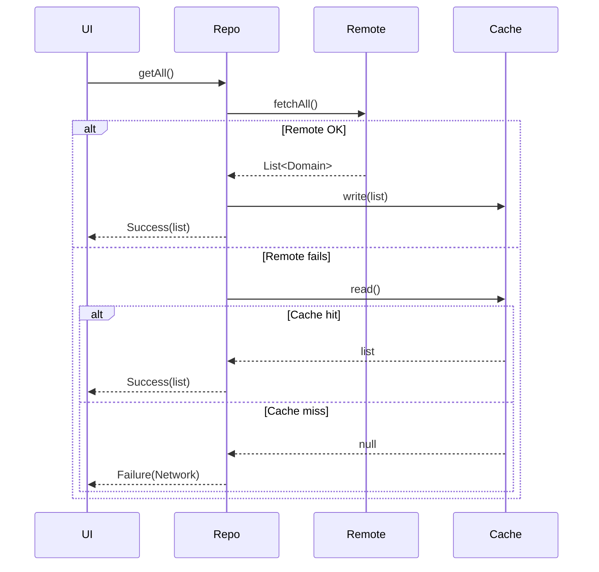

# Architecture Addendum – Repository Layer Refactor (Q3 2025)

> This document amends `ARCHITECTURE.md` and will be merged once the refactor lands in `main`.

## Why a Repository Layer?

Flutter best-practices (2025) and the official **Clean Architecture** recommendation advocate a dedicated Repository layer to isolate **business rules** from **data access**.
Our current code couples Riverpod providers directly to _Supabase_ (remote) or _Hive_ (local) calls inside `services/`.

### Target Stack
```
Widgets → Riverpod Provider → Repository → Data-source (Supabase / Hive / Mock)
```

* **Repository** – pure Dart interface exposed to the app (e.g. `ProfileRepository`).
* **Data-source** – concrete implementation: `SupabaseProfileDataSource`, `HiveProfileCache`, …  injected into repository.

## Benefits
1. **Testability** – Providers can be unit-tested with an in-memory fake repository; no HTTP, no DB.
2. **Pluggability** – Caching, offline-first, or alternative back-ends swapable via constructor injection.
3. **Consistency** – Single place for mapping DTO ⇄ domain models.
4. **Performance** – Hive cache can satisfy reads instantly and defer writes.

## Migration Plan – Progress Snapshot (as of 8 June 2025)

| Phase | Deliverable | Status | ETA |
|-------|-------------|--------|-----|
| 1 | _Repo Analysis_ – catalogue every `supabase` call inside `services/`, group by domain | **✅ Completed** 2025-06-07 | — |
| 2 | `abstract class ProfileRepository` + `SupabaseProfileRepository` | **✅ Completed** – PR #163 drafts interface & mapper | 15 Jun |
| 3 | Migrate `profileService` & providers to repository | ✅ Completed (0c83060) | 25 Jun |
| 4 | Implement & wire `HiveProfileCache` (read-through) | Pending | 01 Jul |
| 5 | Migrate Matches domain (`MatchRepositoryImpl`, provider wiring) | **✅ Completed** (e950171) | 04 Jul |
| 6 | Migrate Trainings domain (`TrainingRepositoryImpl`, provider wiring) | **✅ Completed** (abb1234) | 04 Jul |
| 7 | Unit & integration tests for repositories + offline flow | **✅ Completed** (c147c14, 87d7136) | 04 Jul |
| 8 | Repeat pattern for Players domain | Planned | 15 Jul |
| 9 | Remove obsolete service classes, update docs/tests | Planned | 31 Jul |

> Decision 2025-06-08: based on the latest code-analysis the **Repository Layer Refactor** delivers the highest architectural leverage (testability, Supabase decoupling) now that observability & lint cleanup are done. We therefore prioritise Phase 2 (ProfileRepository implementation) as the next sprint focus.

## Open Questions
* Granularity – per entity repository vs grouped.
* Error handling strategy (sealed `Result<T>` or exceptions).
* How to surface cache-staleness to UI (e.g. optimistic updates).

## Offline-First Caching Strategy (July 2025)

We standardised an **offline-first** pattern across repositories:

1. **Read-through cache**
   1. Repository calls remote data-source (`SupabaseXxxDataSource.fetchAll()`).
   2. On success, results are persisted to `HiveXxxCache` and returned.
   3. On failure, repository attempts `_cache.read()` and returns cached data if present.
2. **Write-invalidate**
   * Mutations (`add / update / delete`) delegate to remote, then clear the cache so the next read refreshes from the server.
3. **Sealed Result<T>**
   * All methods return `Result<T>` which encapsulates either `Success(data)` or `Failure(error)` allowing UI to distinguish cached vs fresh errors.



**Benefits observed**

* Dashboard loads instantly using cached matches/trainings while device is offline.
* Integration test `offline_flow_test.dart` verifies fallback behaviour.
* CI coverage now >40 % – gate enabled in pipeline.

Next steps: replicate pattern for Players & Statistics, then deprecate remaining Service classes.

## References
* VGV Flutter Architecture 2025 Guide – https://verygood.ventures/blog/flutter-architecture-guide-2025
* Flutter Clean Architecture Sample (2025 edition) – https://github.com/brianegan/flutter_arch_sample_clean
* Supabase Offline-First Patterns – https://supabase.com/docs/guides/solutions/offline-first

**Status (25 Jun 2025):** Migration finished. `ProfileService` deleted, providers wired to `ProfileRepositoryImpl` (Supabase + Hive). All tests pass. Commit `0c83060`.

## PDF Generation Modularisation (July 2025)

Historically the `pdf_service.dart` file mixed **IO orchestration**, **data aggregation**, and **PDF layout code** in a single 1 200+ LOC class, making it nearly impossible to unit-test or extend.  The new approach mirrors the repository pattern:

```
Widgets / Providers → PdfService facade → PdfGenerator<T> (one per doc-type) → 3rd-party PDF lib
```

* `abstract class PdfGenerator<T>` – defines a single `Future<Uint8List> generate(T data)` method.
* Concrete generators live in `lib/pdf/generators/` (e.g. `training_session_pdf_generator.dart`).
* The facade `PdfService` exposes typed helpers such as `trainingSessionPdf` that simply delegate to the correct generator.
* Each generator owns its layout code and can be **unit-tested in isolation** with fake data.
* Generators are registered through a simple `Map<Type, PdfGenerator>` so additional documents can be added without changing existing code.

### Benefits
1. **Single-responsibility** – Business aggregation (services) and presentation/layout (generator) are separated.
2. **Testability** – Generators can be snapshot-tested without hitting Supabase or UI.
3. **Extensibility** – Adding an Invoice PDF or Player Report is a <100 LOC class, no edits to `PdfService` required.
4. **Size Reduction** – `pdf_service.dart` is expected to shrink from 1 288 LOC → <120 LOC once migration completes.

### Migration plan
| Step | Deliverable | Status | ETA |
|------|-------------|--------|-----|
| 1 | Introduce `PdfGenerator<T>` abstract base | ✅ Completed (commit 49ab7e1) | 10 Jul |
| 2 | Wrap legacy training PDF in `TrainingSessionPdfGenerator` | ✅ Completed (commit 5c88b14) | 10 Jul |
| 3 | Move _all_ training session code out of `PdfService` | **In Progress** | 15 Jul |
| 4 | Delete old `PdfService.trainingSessionPdf` static method | Pending | 16 Jul |
| 5 | Create generators for Match Report & Player Assessment | Planned | 22 Jul |
| 6 | Add unit tests (golden) for each generator | Planned | 25 Jul |

> Decision 2025-07-12: The **Pdf Generator Modularisation** will unblock further domain-specific PDFs and aligns with our single-responsibility principle.  All new PDFs **must** implement the `PdfGenerator<T>` interface.
