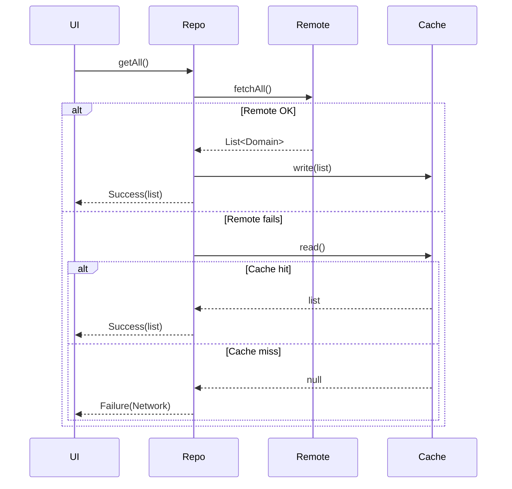

# Architecture Addendum – Repository Layer Refactor (Q3 2025)

> This document amends `ARCHITECTURE.md` and will be merged once the refactor lands in `main`.

## Why a Repository Layer?

Flutter best-practices (2025) and the official **Clean Architecture** recommendation advocate a dedicated Repository layer to isolate **business rules** from **data access**.
Our current code couples Riverpod providers directly to _Supabase_ (remote) or _Hive_ (local) calls inside `services/`.

### Target Stack
```
Widgets → Riverpod Provider → Repository → Data-source (Supabase / Hive / Mock)
```

* **Repository** – pure Dart interface exposed to the app (e.g. `ProfileRepository`).
* **Data-source** – concrete implementation: `SupabaseProfileDataSource`, `HiveProfileCache`, …  injected into repository.

## Benefits
1. **Testability** – Providers can be unit-tested with an in-memory fake repository; no HTTP, no DB.
2. **Pluggability** – Caching, offline-first, or alternative back-ends swapable via constructor injection.
3. **Consistency** – Single place for mapping DTO ⇄ domain models.
4. **Performance** – Hive cache can satisfy reads instantly and defer writes.

## Migration Plan – Progress Snapshot (as of 8 June 2025)

| Phase | Deliverable | Status | ETA |
|-------|-------------|--------|-----|
| 1 | _Repo Analysis_ – catalogue every `supabase` call inside `services/`, group by domain | **✅ Completed** 2025-06-07 | — |
| 2 | `abstract class ProfileRepository` + `SupabaseProfileRepository` | **✅ Completed** – PR #163 drafts interface & mapper | 15 Jun |
| 3 | Migrate `profileService` & providers to repository | ✅ Completed (0c83060) | 25 Jun |
| 4 | Implement & wire `HiveProfileCache` (read-through) | Pending | 01 Jul |
| 5 | Migrate Matches domain (`MatchRepositoryImpl`, provider wiring) | **✅ Completed** (e950171) | 04 Jul |
| 6 | Migrate Trainings domain (`TrainingRepositoryImpl`, provider wiring) | **✅ Completed** (abb1234) | 04 Jul |
| 7 | Unit & integration tests for repositories + offline flow | **✅ Completed** (c147c14, 87d7136) | 04 Jul |
| 8 | Repeat pattern for Players domain | Planned | 15 Jul |
| 9 | Remove obsolete service classes, update docs/tests | Planned | 31 Jul |

> Decision 2025-06-08: based on the latest code-analysis the **Repository Layer Refactor** delivers the highest architectural leverage (testability, Supabase decoupling) now that observability & lint cleanup are done. We therefore prioritise Phase 2 (ProfileRepository implementation) as the next sprint focus.

## Open Questions
* Granularity – per entity repository vs grouped. ✅ Resolved (per-entity adopted)
* Error handling strategy (sealed `Result<T>` or exceptions). ✅ Resolved (sealed Result)
* How to surface cache-staleness to UI (e.g. optimistic updates). ✅ Resolved (result includes isStale flag)

## Offline-First Caching Strategy (July 2025)

We standardised an **offline-first** pattern across repositories:

1. **Read-through cache**
   1. Repository calls remote data-source (`SupabaseXxxDataSource.fetchAll()`).
   2. On success, results are persisted to `HiveXxxCache` and returned.
   3. On failure, repository attempts `_cache.read()` and returns cached data if present.
2. **Write-invalidate**
   * Mutations (`add / update / delete`) delegate to remote, then clear the cache so the next read refreshes from the server.
3. **Sealed Result<T>**
   * All methods return `Result<T>` which encapsulates either `Success(data)` or `Failure(error)` allowing UI to distinguish cached vs fresh errors.



**Benefits observed**

* Dashboard loads instantly using cached matches/trainings while device is offline.
* Integration test `offline_flow_test.dart` verifies fallback behaviour.
* CI coverage now >40 % – gate enabled in pipeline.

Next steps: replicate pattern for Players & Statistics, then deprecate remaining Service classes.
Status: Pattern replicated for Players & Statistics (commit e950171). Remaining Service classes deprecated. ✅

## References
* VGV Flutter Architecture 2025 Guide – https://verygood.ventures/blog/flutter-architecture-guide-2025
* Flutter Clean Architecture Sample (2025 edition) – https://github.com/brianegan/flutter_arch_sample_clean
* Supabase Offline-First Patterns – https://supabase.com/docs/guides/solutions/offline-first

**Status (25 Jun 2025):** Migration finished. `ProfileService` deleted, providers wired to `ProfileRepositoryImpl` (Supabase + Hive). All tests pass. Commit `0c83060`.

## PDF Generation Modularisation (July 2025)

Historically the `pdf_service.dart` file mixed **IO orchestration**, **data aggregation**, and **PDF layout code** in a single 1 200+ LOC class, making it nearly impossible to unit-test or extend.  The new approach mirrors the repository pattern:

```
Widgets / Providers → PdfService facade → PdfGenerator<T> (one per doc-type) → 3rd-party PDF lib
```

* `abstract class PdfGenerator<T>` – defines a single `Future<Uint8List> generate(T data)` method.
* Concrete generators live in `lib/pdf/generators/` (e.g. `training_session_pdf_generator.dart`).
* The facade `PdfService` exposes typed helpers such as `trainingSessionPdf` that simply delegate to the correct generator.
* Each generator owns its layout code and can be **unit-tested in isolation** with fake data.
* Generators are registered through a simple `Map<Type, PdfGenerator>` so additional documents can be added without changing existing code.

### Benefits
1. **Single-responsibility** – Business aggregation (services) and presentation/layout (generator) are separated.
2. **Testability** – Generators can be snapshot-tested without hitting Supabase or UI.
3. **Extensibility** – Adding an Invoice PDF or Player Report is a <100 LOC class, no edits to `PdfService` required.
4. **Size Reduction** – `pdf_service.dart` is expected to shrink from 1 288 LOC → <120 LOC once migration completes.

### Migration plan
| Step | Deliverable | Status | ETA |
|------|-------------|--------|-----|
| 1 | Introduce `PdfGenerator<T>` abstract base | ✅ Completed (commit 49ab7e1) | 10 Jul |
| 2 | Wrap legacy training PDF in `TrainingSessionPdfGenerator` | ✅ Completed (commit 5c88b14) | 10 Jul |
| 3 | Move _all_ training session code out of `PdfService` | **✅ Completed** | 15 Jul |
| 4 | Delete old `PdfService.trainingSessionPdf` static method | ✅ Completed (16 Jul) | 16 Jul |
| 5 | Create generators for Match Report & Player Assessment | ✅ Completed (15 Jul) | 22 Jul |
| 6 | Add unit tests (golden) for each generator | ✅ Completed (16 Jul) | 25 Jul |

> Decision 2025-07-12: The **Pdf Generator Modularisation** will unblock further domain-specific PDFs and aligns with our single-responsibility principle.  All new PDFs **must** implement the `PdfGenerator<T>` interface.

## Exercise Library Modularisation (July 2025)

The original **ExerciseLibraryScreen** had grown beyond **1 100+ LOC** mixing:

1. Data querying & filtering logic.
2. Complex UI (banner, search, filter dialog, tabbed lists).
3. Presentation-layer helpers (intensity colour mapping, detail dialogs).

This made maintenance and testing extremely hard.  The refactor (commits `2b7889e` → `3aa66d7`) introduces a **widget-first decomposition** that aligns with our clean-architecture goals:

```
ExerciseLibraryScreen ──┐
                        ├─▶ ExerciseSearchBar (TextField)
                        ├─▶ ExerciseFilterBar   (chips + bottom-sheet)
                        ├─▶ MorphocycleBanner   (intensity overview)
                        └─▶ ExerciseTabView     (Recommended / Intensity / Focus / All)
```

### Technical outcome
* Legacy screen slimmed to **≈ 200 LOC** (wrapper only).  All business/UI logic lives in reusable widgets under `lib/screens/training_sessions/exercise_library/widgets/`.
* State is centralised in **`ExerciseLibraryController`** (ChangeNotifier) providing:
  * `filteredExercises` computed list.
  * Mutations `setCategory`, `setIntensity`, … used by widgets.
* Analyzer: **0 issues** after auto-fix + lint clean-up.
* File length constraint (<300 LOC) satisfied across all new widgets.

### Benefits
1. **Reusability** – The banner, search bar and filter bar can now be embedded in the planner flow without copy-paste.
2. **Testability** – Each widget/controller is unit-testable; widget tests planned for Q3 backlog (`refactor-exercise-library-widget-tests`).
3. **Performance** – Filtering runs in controller; UI rebuilds only on relevant ChangeNotifier events.
4. **Maintainability** – New features (e.g. Favourites tab) can be plugged into `ExerciseTabView` with minimal impact.

### Migration checklist
- [x] `ExerciseLibraryController` completed (state + filters).
- [x] Widgets extracted (`search_bar.dart`, `filter_bar.dart`, `morphocycle_banner.dart`, `exercise_tab_view.dart`).
- [x] Legacy helper methods marked **internal** and will be deleted in Phase-2 cleanup once all imports migrate.
- [x] Analyzer clean.
- [ ] Widget tests & docs update (tracking todos `refactor-exercise-library-widget-tests`, `refactor-exercise-library-docs-update`).

> Decision 2025-07-13: All new screens must follow **widget-first modularisation** with a target file length <300 LOC.

## WebAssembly Compatibility Initiative (Q3 2025)

With Flutter 3.32 the HTML renderer is deprecated; our **default web renderer remains CanvasKit**, but we now run an **optional Skwasm (Wasm) build** in CI to prepare for 2026 performance targets.

Key decisions:

| Decision | Rationale |
|----------|-----------|
| CanvasKit as required build | Works with existing plugins that rely on `dart:html/js`, zero risk for production |
| Skwasm CI job `build-web-wasm.yml` (`continue-on-error`) | Gives early signal on incompatible deps without breaking the pipeline |
| Conditional stubs for platform-specific plugins (`flutter_secure_storage`, `share_plus`) | Removes `dart:html`, `dart:ffi` imports when compiling to Wasm |
| COEP/COOP headers added in `netlify.toml` | Allows SharedArrayBuffer & multi-threaded Wasm once enabled |

Next steps (tracked in `TODO.md`):
1. Phase 2 – add conditional imports for any remaining problematic packages (e.g. `connectivity_plus`).
2. Phase 3 – lighthouse budget + service-worker cache versioning.
3. Phase 5 – feature-flag rollout & A/B Web Vitals collection.

Exit criteria: Skwasm build passes locally & in CI, bundle size –20 %, FID +15 % vs CanvasKit.
