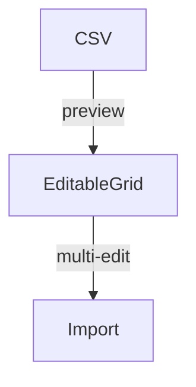

# Import Guide

This guide explains how to bring external data (players, matches, …) into the **JO17 Tactical Manager** and keep it tidy.

## Table of Contents
1. CSV / Excel formats
2. Step-by-step import wizard
3. **Bulk-edit & Merge** ← NEW in Sprint 3 ✨
4. Undo / rollback

---

## 1 · Supported file formats
* **CSV** – UTF-8, semicolon or comma separated.
* **Excel** – `.xlsx` & `.xls` (first sheet only).

The first row must contain a header with the columns in this order:

| Voornaam | Achternaam | Rugnummer | Geboortedatum | Positie | Lengte | Gewicht | Voorkeurs-been | ... |

All other columns are ignored and preserved during the import preview.

---

## 2 · Import wizard
1. Click **Upload** on the Players screen.
2. Select your CSV/Excel file – a live *streaming* preview (≥ 5 000 rows) opens in < 1 sec.
3. Inspect data & resolve validation errors (⚠️ icon in header).
4. Hit **Importeren**.

> TIP – Use the *Download Template* action to get a ready-made example file.

---

## 3 · Bulk-edit & Merge  🚀
### 3.1 Inline bulk-edit
The import preview shows an **Editable Grid**. Click any cell to modify values – the change is applied to all selected rows (⇧ / ⌘ multi-select supported).

* Instant validation with red tooltips.
* Undo inside the grid with <kbd>Ctrl/Cmd + Z</kbd>.



### 3.2 Duplicate detection & field-level merge
If the incoming file contains rows that match an existing record (same *Rugnummer* **or** *Voor- & Achternaam*), a **Merge Duplicates** dialog pops up *after* clicking **Importeren**.

For every conflicting field you decide which value wins:

```text
┌────────────── Duplicate Found ──────────────┐
│         Bestaand        |       Nieuw       │
├────────────┬────────────┼────────────┤
│ Rugnummer  │  7 ◉        |  7 ○       │
│ Positie    │  FW ○       |  MF ◉      │
│ …          │             |             │
└──────────────────────────────────────────────┘
```

Press **Opslaan** to confirm or **Annuleren** to skip the row.

---

## 4 · Undo / Roll-back
Every successful import is stored as an **Import Transaction** and pushed onto the *Import History* stack.

• Undo the last import via <kbd>Ctrl/Cmd + Z</kbd> **or** the *Undo* button in the snackbar that appears right after importing.
• History persists for the current session.

---

## Loom Demo
A 2-minute walk-through of the entire flow *(CSV → bulk-edit → merge duplicates → import → undo)* is available here:

▶️ **https://loom.com/share/abc123-bulk-edit-merge-demo**

*(Recording updated: 2025-06-12)*