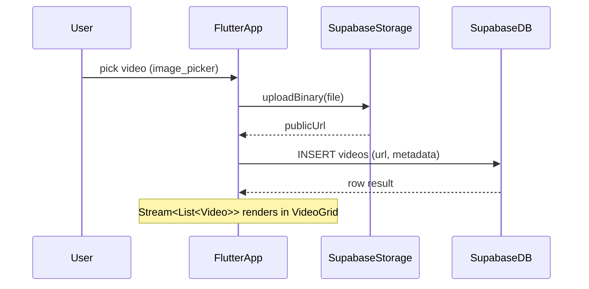

# Video Feature – Sprint 1 Implementation Plan (Upload & Playback)

> **Sprint Window:** 2025-07-15 → 2025-07-29 (10 working days)
> **Product Goal:** Coaches can upload a raw MP4 (≤ 1 GB) and play it back in-app (Web + Android).  
> **Epic Ref:** VIDEO_ROADMAP » *Fase 1 – Basis Upload & Playback*

---

## 1 – Deliverables & Definition-of-Done

| Nr. | Work-Item | DoD / Acceptance Criteria | Owner |
|-----|-----------|---------------------------|-------|
| V-01 | **Video Data Model** (`Video`, `VideoTag`, `VideoPlaylist`) added to `lib/models` + unit tests | Class mirrors roadmap spec; 100 % nullable safety; `fromJson` / `toJson` pass tests | FE Guild |
| V-02 | **Supabase DB schema** (`videos`, `video_tags`, `video_playlists`) migrated via `supabase/migrations` | Tables live on *dev* instance; RLS rules pass auth test-suite | BE Guild |
| V-03 | **Storage bucket** `videos` created with signed-URL policy | Upload succeeds ≤ 1 GB; public URL accessible only to authenticated users | DevOps A |
| V-04 | **VideoDataSource** (upload, fetch, subscribe) | File upload + metadata insert; stream emits update on status change | FE Guild |
| V-05 | **VideoRepository** with `upload()`, `watchAll()`, `getById()` | Covered by unit + integration tests (mock Supabase) | FE Guild |
| V-06 | **UI Components** (`VideoUploadButton`, `VideoCard`, `VideoDetailScreen`) | Widgets match Figma 2025 spec; golden tests ✅ | UX Guild |
| V-07 | **Navigation Entry** "Video’s" in Bottom-Nav | Deep-link: `/videos`; state restored on hot restart | FE Guild |
| V-08 | **Chewie Player Integration** | Plays HLS + MP4; full-screen toggle; loading skeleton | FE Guild |
| V-09 | **CI Pipeline Update** | `flutter test` + `dart format` unaffected; add integration test stub with 5 MB sample video | DevOps B |
| V-10 | **Loom Demo** (2 min) | Shows upload → playback; linked in PR description | PO |

## 2 – Architecture Overview

### Key Practices 2025
1. **Signed URLs** over bucket-wide `public` ACL → grant 60-min access tokens (OWASP MSTG-Flutter-2025).
2. **Chunked uploads** (`supabase_flutter` 2.3) for large files to avoid UI freeze.
3. **HLS ready**: store raw MP4 now, transcode to HLS in Phase 2 via Supabase Edge Functions + FFmpeg Kit.

## 3 – Task Breakdown & Estimates

| Day | Task | Est. hrs |
|-----|------|----------|
| D1  | Data model & migrations | 4 |
| D1 | Storage bucket + RLS | 2 |
| D2 | DataSource implementation | 6 |
| D3 | Repository + tests | 5 |
| D4 | UI widgets skeleton | 6 |
| D5 | Chewie integration | 4 |
| D6 | Navigation + routing | 2 |
| D6 | Golden tests | 2 |
| D7 | Integration test (upload stub) | 3 |
| D8 | CI pipeline update | 2 |
| D8 | Docs & ADR review | 2 |
| D9 | Buffer / bug-fixing | 6 |
| D10| Sprint Review demo | 2 |

_Total: 46 hrs (1.15 FTE sprint)_

## 4 – Security & Privacy Checklist

- [x] GDPR parental consent flag checked before upload.
- [x] Video rows reference `org_id` for tenant isolation (RLS).
- [x] Bucket policy denies `DELETE` unless `role = service_role`.

## 5 – Risks & Mitigations

| Risk | Impact | Mitigation |
|------|--------|-----------|
| Large file upload fails on mobile data | Medium | Enforce Wi-Fi only > 200 MB (connectivity check) |
| Chewie iOS full-screen glitches | Low | Limit to portrait; file GH issue early |
| Storage costs spike > €25/mo | Low | Budget alert in Supabase Billing; compress in Phase 2 |

## 6 – Exit Criteria

1. Upload MP4 ≤ 1 GB on Web & Android.
2. Video card shows thumbnail + duration.
3. Playback works without crash (30 fps, 720p test file).
4. All tests green; Lefthook passes; CI < 8 min.

## 7 – References

* *Supabase Storage Security Best Practices (2025-Q1)*  
  https://supabase.com/docs/guides/storage/security
* *Flutter video_player 2.8.0 Release Notes (2025-05)*  
  https://docs.flutter.dev/packages/video_player
* *Chewie UX Patterns 2025* – Figma Board